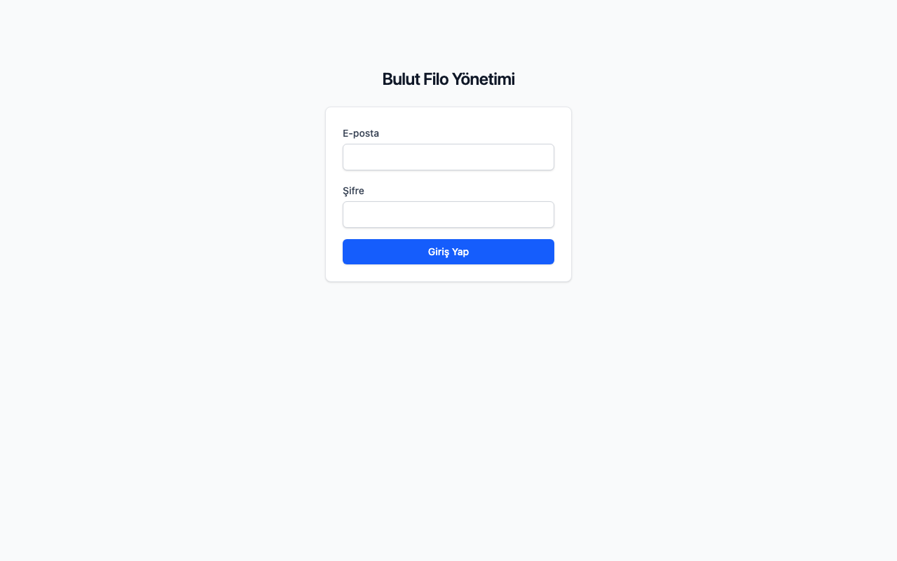
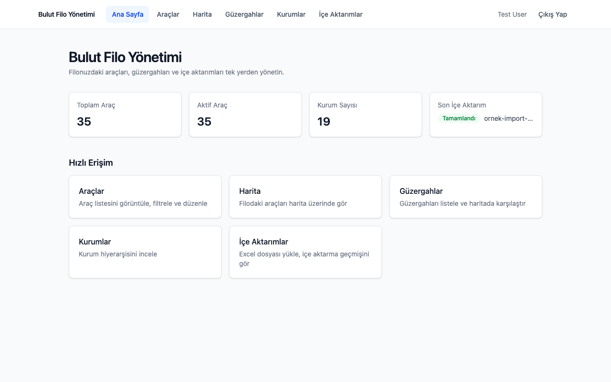
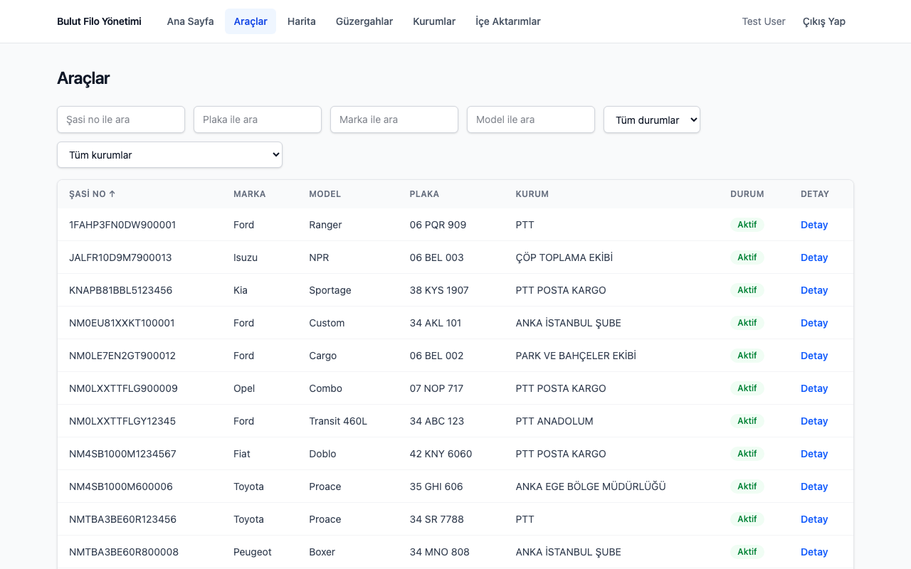
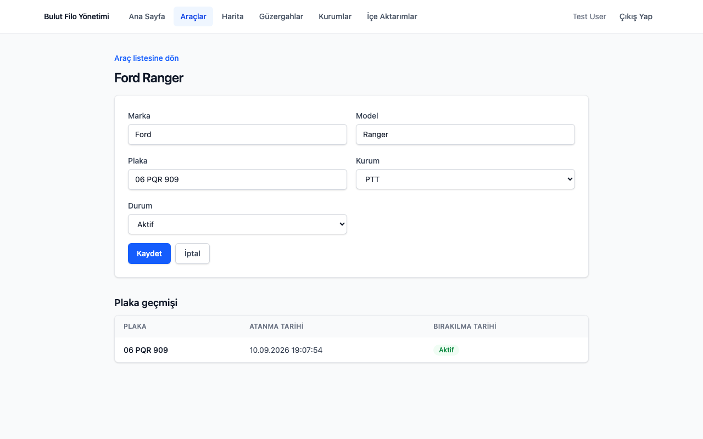
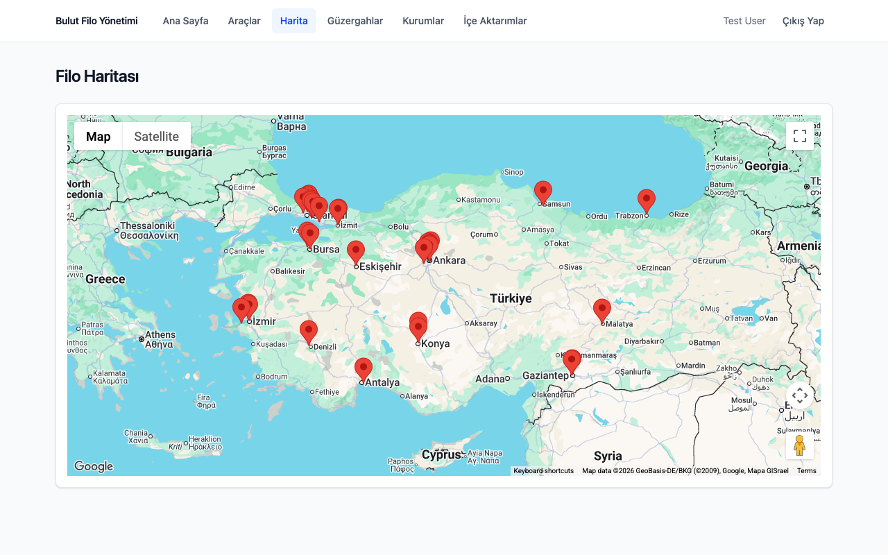
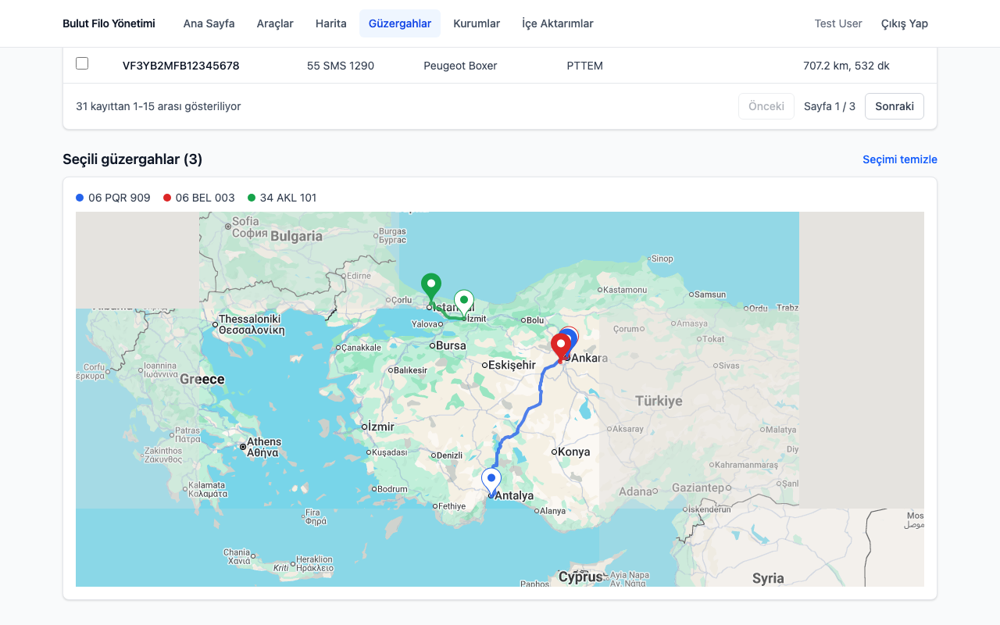
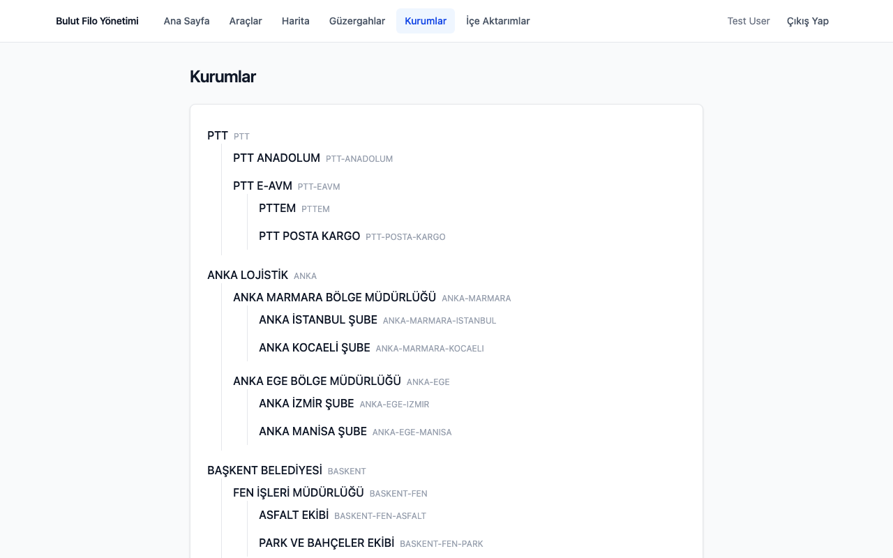

# Bulut Filo Yönetimi

**Bulut Filo Yönetimi** is a fleet management application for
organisations that track vehicles across several institutions,
departments, or branches. In practice, fleet data like this usually lives
in someone's Excel sheet — plates, VINs, and addresses typed by hand,
never mapped to real coordinates or routes, and easy to overwrite by
accident on the next update. This app turns that spreadsheet into a live,
queryable fleet: upload the Excel file and the app takes care of the
rest. Messy, human-typed addresses are normalised by the OpenAI API,
resolved to coordinates via Google Geocoding, and turned into real
driving routes via the Google Routes API — all in the background,
without blocking the upload. A vehicle's identity is its VIN, not its
plate, so re-importing an updated fleet list correctly detects plate
transfers and flags genuine conflicts instead of silently overwriting
data.

On top of that pipeline, the app gives you:

- a searchable, filterable, server-side paginated vehicle list, editable
  in place (brand, model, institution, plate, fleet status);
- a live map of where every active vehicle currently starts its route;
- a **Güzergahlar** screen to select several vehicles and compare their
  routes — distance and path — on one map;
- a read-only institution hierarchy (unlimited depth) for organising
  vehicles by department, branch, or region;

served through a token-authenticated JSON API with server-side caching and
a fully queued import pipeline (Laravel Horizon), so a large Excel file
never ties up a web request.

## Screenshots

| | |
|---|---|
|  |  |
| Login | Dashboard |
|  |  |
| Vehicle list (server-side filter/sort/paginate) | Vehicle detail — edit brand/model/institution/plate/status |
|  |  |
| Fleet map — every active vehicle's current start location | Güzergahlar — multi-select routes drawn together on one map |
|  | |
| Institutions — three independent trees, arbitrary depth | |

## Tech stack

- **Backend:** PHP 8.4, Laravel 13, MySQL 8, Redis (queue + cache), Laravel Horizon, Laravel Sanctum (token auth)
- **Frontend:** React 19, TypeScript, Vite, TanStack Query, TanStack Table, React Router, `@vis.gl/react-google-maps`, Tailwind CSS, react-hook-form + zod, Vitest + React Testing Library
- **Infrastructure:** Docker Compose (php-fpm, nginx, mysql, redis, horizon)
- **External services:** OpenAI Chat Completions API, Google Geocoding API, Google Routes API

## Installation

Requirements: Docker Desktop with Docker Compose v2 and Node.js (CI runs
Node 26; no `engines` constraint is enforced locally). PHP and Composer
run *inside* the containers, so you don't need either installed on your
host machine for the backend.

### Backend

1. Copy the environment file. The defaults already match the Docker Compose
   services below and work as-is — you only need to fill in the two API
   keys (see step 6):

   ```
   cp .env.example .env
   ```

2. Build the images and start all services. The `--build` flag is required on
   the first run, otherwise the `horizon` service (which reuses the `app`
   image) fails with a `pull access denied` error:

   ```
   docker compose up -d --build
   ```

3. Install PHP dependencies inside the `app` container. The image only
   ships the `composer` binary, not `vendor/` — this step has to run
   after the containers are up:

   ```
   docker compose exec app composer install
   ```

4. Generate the application key (writes `APP_KEY` into `.env`):

   ```
   docker compose exec app php artisan key:generate
   ```

5. Run migrations and seed the institution hierarchy and demo user:

   ```
   docker compose exec app php artisan migrate --seed
   ```

6. Get free API keys and add them to `.env` as `OPENAI_API_KEY` and
   `GOOGLE_MAPS_SERVER_KEY`, then restart the containers
   (`docker compose restart app horizon`) so they're picked up. Without
   these, everything works except the import pipeline's address
   normalisation/geocoding/routing step — uploaded rows will fail there.
   - OpenAI: [platform.openai.com](https://platform.openai.com) → API keys.
   - Google: [console.cloud.google.com](https://console.cloud.google.com) →
     enable the **Geocoding API** and **Routes API**, then create a
     server-restricted API key.

7. Open http://localhost:8080/up — should return a healthy response, and
   http://localhost:8080/horizon should show the queue dashboard.

### Frontend

The React app is a separate Vite project under `frontend/`, not served by
the Docker Compose stack above.

1. Install dependencies:

   ```
   cd frontend
   npm install
   ```

2. Copy the environment file:

   ```
   cp .env.example .env
   ```

   `VITE_API_BASE_URL` already points at the backend from the previous
   section. Set `VITE_GOOGLE_MAPS_BROWSER_KEY` to a Google Maps API key —
   this must be a separate, **browser-restricted** key (Maps JavaScript
   API), not the `GOOGLE_MAPS_SERVER_KEY` from the backend section above,
   otherwise the map won't render at all. Create one from the same
   [console.cloud.google.com](https://console.cloud.google.com) project.

3. Start the dev server:

   ```
   npm run dev
   ```

4. Open http://localhost:5173.

### Sample data

Institutions are seeded automatically — three independent trees (PTT, ANKA
LOJİSTİK, BAŞKENT BELEDİYESİ; see `InstitutionSeeder` for the full
hierarchy). There are no vehicles until an Excel file is imported, either
through the Imports screen or by uploading one of the ready-made files
under `docs/`:

- `ornek-import.xlsx` — a first import, PTT institutions.
- `ornek-import-plaka-devri.xlsx` — reuses some of those VINs/plates to
  exercise the decision tree's plate-transfer and conflict branches.
- `ornek-import-anka.xlsx` — ANKA LOJİSTİK only.
- `ornek-import-karma-kurumlar.xlsx` — all three institution trees mixed in
  one file.

### Logging in

The entire API (except `POST /api/v1/auth/login`) requires a Sanctum bearer
token — the frontend's login screen at `/login` handles this. The seeder
creates one demo user for local development:

```
email:    test@example.com
password: password
```

This is a development-only credential from Laravel's default seeder, not a
real account — never reuse it outside a local/demo environment.

### Verifying the setup

```
docker compose ps                                          # all services healthy/running
docker compose exec app php artisan --version
docker compose exec app php -m | grep -Ei 'pdo_mysql|redis|intl|gd|zip|bcmath|opcache'
docker compose exec app php artisan tinker --execute="DB::connection()->getPdo(); echo 'DB OK';"
docker compose exec app php artisan tinker --execute="Cache::store('redis')->put('healthcheck','ok',10); echo Cache::store('redis')->get('healthcheck');"
docker compose logs horizon --tail=50                       # should run without errors
curl -s http://localhost:8080/horizon/api/stats | head -c 200 # Horizon dashboard API responds
```

## Architecture

### Domain model

A vehicle's identity is its **VIN** (chassis number), not its plate — a
plate is a time-bound assignment that can change over the vehicle's
lifetime:

```
vehicles        id, vin (unique), brand, model, institution_id, status
vehicle_plates  id, vehicle_id, plate, assigned_at, released_at
```

`status` is a backed enum (`active` / `passive` / `left_fleet`); vehicles are
never hard-deleted. An active plate assignment's `released_at` is a sentinel
value (`9999-12-31 00:00:00`), and a `UNIQUE(plate, released_at)` constraint
guarantees at most one active assignment per plate at a time.

Institutions form a tree (arbitrary depth, resolved recursively — never
hardcoded to a level count) and are read-only: seeded once, no CRUD.

A vehicle's detail page also supports editing brand/model/institution/plate/
status (`PATCH /api/v1/vehicles/{vehicle}`). A plate change goes through the
same conflict-checked transfer logic as the import flow (see below) — an
attempt to take a plate that's active on another vehicle is rejected with
`409` and the conflicting vehicle's VIN, never silently overwritten. This is
also the only way a vehicle currently transitions to `passive` or
`left_fleet` — the import decision tree only ever sets vehicles `active`
(scenario 1's reactivation aside), so without a manual status change a
vehicle can never actually leave the fleet.

### Authentication

The API is protected by Laravel Sanctum, token-based (not the cookie/SPA
mode — the frontend is a separate origin in dev). `POST /api/v1/auth/login`
exchanges email/password for a bearer token; every other `/api/v1/*` route
requires `Authorization: Bearer <token>` via the `auth:sanctum` middleware.
`POST /api/v1/auth/logout` revokes the current token, `GET /api/v1/auth/me`
returns the authenticated user. The frontend stores the token in
`localStorage`, attaches it to every request, and clears it (redirecting to
`/login`) on any `401` response.

### Excel import decision tree

Uploading a file dispatches `ProcessVehicleImportJob`, which seeds one
`ImportRow` per data row, then dispatches one `ProcessImportRowJob` per
pending row so the decision tree runs in parallel across queue workers
instead of blocking inside a single job (the same pattern already used for
the address/route stages below). Each row applies a four-branch decision
tree via `VehicleImportService`:

1. **VIN exists** — update the vehicle; if the plate changed, transfer it
   via `PlateTransferService` (see below); reactivate the vehicle if it was
   inactive.
2. **VIN is new, the plate is currently held by a passive/left-fleet
   vehicle** — a plate transfer: close the old assignment, open a new one
   under the new VIN.
3. **VIN is new, the plate is currently active on another vehicle** — a
   genuine conflict. The row is never silently overwritten; it's marked
   `needs_review` with a reference to the conflicting vehicle, for a human to
   resolve.
4. **VIN is new, the plate is free** — assign it directly.

Scenarios 2–4's transfer/conflict logic lives in `PlateTransferService`,
shared with the vehicle detail edit endpoint above so both paths enforce the
same uniqueness rule. The batch is marked `completed` once every row's job
has finished — with concurrent row jobs, whichever one observes zero
remaining pending rows is the one that flips the status (idempotent, so a
rare tie between two jobs is harmless).

### Address resolution, geocoding and routing

Each row's start/end address (if present) is normalised via OpenAI
(`AddressFormatterInterface`), geocoded via Google Geocoding
(`GeocoderInterface`), and a route between the two is computed once via the
Google Routes API (`RouteProviderInterface`) — cached by address/route-pair
hash and never recomputed on page load. All three external services sit
behind interfaces bound in `AppServiceProvider`, are rate-limited via
`Redis::throttle`, and retried via `Http::retry`.

### Vehicle location model

A vehicle's coordinates and route live on the `ImportRow` that produced
them, not on `Vehicle` itself — a vehicle can appear in several import
batches over its lifetime. `vehicles.latest_import_row_id` is a denormalised
pointer, set whenever a row is successfully linked to a vehicle, to that
vehicle's most recently processed row. This gives the fleet map and the
Güzergahlar screen a vehicle's "current" start/end coordinates and route via
a single join (`Vehicle::latestImportRow()`), instead of a "latest row per
vehicle" subquery.

### Read API and frontend

`GET /api/v1/vehicles` and `GET /api/v1/institutions` expose the domain for
the frontend's server-side sortable/filterable/paginated tables
(`spatie/laravel-query-builder`). `GET /api/v1/vehicles/map` and
`GET /api/v1/vehicles/routes` reuse the same repository/filter machinery for
the fleet map and Güzergahlar screens. Filter/sort/page state lives entirely
in the URL query string, using the same parameter names the backend query
builder expects — no separate client-side filter state to keep in sync.
Filtering vehicles by institution cascades down the tree: selecting a parent
institution includes every descendant institution's vehicles.

### Queue processing

All long-running work — Excel parsing and every external API call — runs in
queued jobs, processed by Laravel Horizon (dashboard at `/horizon`), one job
per row per stage (VIN/plate decision, address resolution, route
computation) so rows process in parallel across workers rather than one row
blocking the next. A job that hits a rate limit releases itself back onto
the queue with a delay instead of failing.

### Screens

| Route | Purpose |
|---|---|
| `/login` | Email/password login (unauthenticated only) |
| `/` | Dashboard: fleet stats, latest import status, quick links to every screen |
| `/vehicles` | Server-side filterable (every column)/sortable/paginated vehicle list |
| `/vehicles/:id` | Vehicle detail, including full plate history; edit brand/model/institution/plate/status |
| `/fleet-map` | Every active vehicle as a pin at its current start location; plate/brand/model/institution on hover or tap |
| `/routes` | Fleet-wide, filterable/sortable/paginated list of vehicles with a computed route; multi-select to draw several routes on one map |
| `/imports` | Upload an Excel file; browse past import batches |
| `/imports/:id` | Per-row status (including `needs_review` conflicts with the conflicting VIN), multi-select rows to draw their routes together on a map |

All routes except `/login` require an authenticated session (see
Authentication above) and redirect there otherwise.

## Development

```
./vendor/bin/pint --test          # PSR-12 style check
./vendor/bin/phpstan analyse      # static analysis (Larastan, level 6)
./vendor/bin/pest                 # backend tests
```

```
cd frontend
npm run lint                      # oxlint
npm run typecheck                 # tsc --noEmit
npm run test                      # vitest
npm run build                     # production build
```

All six checks run in CI on every push (`.github/workflows/ci.yml`); a
build isn't considered done until all of them are green.
